# CRYPTEX LAB — Complete Client Guide

> **Legal notice:** Only use this tool on wallets you own or are explicitly and legally authorized to recover. All actions are permanently audit-logged.

---

## Table of Contents

1. [Beginner Concepts — Read This First](#1-beginner-concepts--read-this-first)
2. [Before You Start — Getting Your License](#2-before-you-start--getting-your-license)
3. [What Is in Your Package](#3-what-is-in-your-package)
4. [Installation](#4-installation)
5. [Setting Up Two-Factor Authentication (2FA)](#5-setting-up-two-factor-authentication-2fa)
6. [Launching the Application](#6-launching-the-application)
7. [Understanding the Interface](#7-understanding-the-interface)
8. [Role Assignment and Elevation](#8-role-assignment-and-elevation)
9. [Working Offline — The Golden Rule](#9-working-offline--the-golden-rule)
10. [Starting a Case](#10-starting-a-case)
11. [Recovery Tools — Detailed Guide](#11-recovery-tools--detailed-guide)
12. [Forensics Tools — Detailed Guide](#12-forensics-tools--detailed-guide)
13. [Utilities](#13-utilities)
14. [Live Analysis Mode](#14-live-analysis-mode)
15. [Common Workflows — Step by Step](#15-common-workflows--step-by-step)
16. [Security Best Practices](#16-security-best-practices)
17. [Troubleshooting](#17-troubleshooting)

---

## 1. Beginner Concepts — Read This First

If you are already familiar with cryptocurrency wallets and seed phrases, skip ahead to [Section 2](#2-before-you-start--getting-your-license). If not, read this section carefully — understanding these concepts will make every tool in Cryptex Lab make sense immediately.

### What is a cryptocurrency wallet?

A cryptocurrency wallet does not actually store your coins. Your coins live on the blockchain (a global, permanent ledger). What a wallet stores is a **private key** — a secret number that proves you own specific coins and allows you to spend them. Whoever holds the private key controls the funds.

### What is a seed phrase (mnemonic)?

Generating and backing up a private key as a raw number (e.g. `0x3a9f...`) is error-prone. In 1985 a standard called **BIP39** was created to represent private keys as a list of 12, 18, or 24 common English words. This list is called a **seed phrase**, **recovery phrase**, or **mnemonic**.

Example (not real — never use a published phrase):
```
abandon abandon abandon abandon abandon abandon abandon abandon abandon abandon abandon about
```

From those 12 words, a deterministic math process can recreate your private key and every wallet address you ever used. This is why losing your seed phrase means losing access to your funds permanently — and why recovering one that has typos, missing words, or a forgotten passphrase is possible with the right tools.

### What is a derivation path?

A single seed phrase can mathematically generate thousands of different wallet addresses. A **derivation path** is the instruction that tells the software which address to produce. Different wallets use different default paths:

| Standard | Path | Used by |
|---|---|---|
| BIP44 | `m/44'/60'/0'/0/0` | MetaMask (ETH), most ETH wallets |
| BIP44 | `m/44'/0'/0'/0/0` | Bitcoin legacy (1...) |
| BIP49 | `m/49'/0'/0'/0/0` | Bitcoin SegWit (3...) |
| BIP84 | `m/84'/0'/0'/0/0` | Bitcoin Native SegWit (bc1...) |

If a tool derives addresses from your seed but does not find your balance, the derivation path is often the reason. Cryptex Lab scans all standard paths automatically.

### What is a passphrase (the "25th word")?

BIP39 supports an optional extra passphrase on top of the seed phrase. Hardware wallets like Trezor call this the "hidden wallet" feature. If you used a passphrase when setting up your wallet, you must provide it during recovery. A blank passphrase is also valid (most users have none). Cryptex Lab can test thousands of passphrase candidates automatically.

### What is BIP38?

BIP38 is a standard for encrypting a single Bitcoin private key with a passphrase so it can be printed on paper safely. These keys start with `6P`. You need both the encrypted key and the passphrase to access the funds.

### What is SLIP39?

SLIP39 (Shamir's Secret Sharing) splits a seed into multiple shares so that access requires a threshold number of shares (e.g. 3 out of 5). Even if someone steals two shares, they cannot reconstruct the wallet. Trezor Model T supports this natively.

### What is a brain wallet?

A brain wallet derives a private key directly from a passphrase (e.g. a memorable sentence) using a hash function — no seed phrase or hardware involved. Brain wallets are considered insecure for new wallets because common phrases are pre-computed by attackers, but Cryptex Lab can recover the address if you remember the original phrase.

### What is an xpub / xprv?

An **extended public key (xpub)** lets you derive all receiving addresses for a wallet without exposing the private key. Watch-only wallets use these. An **extended private key (xprv)** can derive addresses AND spend funds. Cryptex Lab can scan addresses from either without requiring the original seed.

---

## 2. Before You Start — Getting Your License

Cryptex Lab ships **without a license** — like commercial software, you activate it after installation using a license key tied to your specific machine.

### How activation works

1. You install the application and launch it for the first time
2. The app displays your **Machine ID** — a fingerprint of your hardware
3. You send that Machine ID to your administrator (Titan Code)
4. Your administrator generates a license key locked to your Machine ID
5. You paste the `CXLAB-...` key into the app — activation is instant and permanent

**Your license is machine-locked.** If you move to a new computer, contact your administrator for a new key. The application will not run on unauthorized hardware.

---

## 3. What Is in Your Package

When you receive the distribution ZIP (`cryptex_lab_client_compiled.zip`), it contains:

| File / Folder | Purpose |
|---|---|
| `app.py` | Main application |
| `recovery_utils.py`, `derivation_utils.py`, etc. | Core logic modules |
| `*.so` / `*.pyd` files | Compiled security modules (cannot be read as source) |
| `requirements.txt` | Python dependencies list |
| `install.py` / `install.sh` / `install.bat` | Automated installer |
| `launcher.py` | App launcher (use this to start the app) |
| `public_key.pem` | License verification key |
| `manifest.json` | Build integrity manifest (tamper detection) |
| `TUTORIAL_CLIENT.md` | This document |
| `assets/` | Icons and screenshots |

**Never received:** `private_key.pem`, source code for security modules, or license.json. These stay with your administrator.

---

## 4. Installation

### Requirements

- Python 3.10 or newer
- 4 GB RAM minimum (8 GB recommended for passphrase attacks)
- 500 MB disk space
- No internet connection required (air-gapped operation)

### Linux / macOS

Open a terminal in the folder where you extracted the ZIP and run:

```bash
python install.py
```

This creates a Python virtual environment, installs all dependencies from `requirements.txt`, and verifies the build integrity signature.

### Windows

Double-click `install.bat`, or open Command Prompt and run:

```cmd
python install.py
```

### What the installer does

1. Creates a `venv/` virtual environment — isolated from your system Python
2. Installs all dependencies listed in `requirements.txt`
3. Verifies the build integrity manifest (all shipped files are checked against their cryptographic hashes — if any file was modified in transit, installation halts)
4. Prints a success message with launch instructions

### Air-gapped installation (no internet on the workstation)

If the workstation has no internet access at all:

1. On an internet-connected machine, download the wheels:
   ```bash
   pip download -r requirements.txt -d ./offline_wheels
   ```
2. Transfer `offline_wheels/` to the workstation via USB
3. On the workstation, run:
   ```bash
   pip install --no-index --find-links=./offline_wheels -r requirements.txt
   ```

---

## 5. Setting Up Two-Factor Authentication (2FA)

The first time you launch Cryptex Lab after a successful license activation, you will see the **Security Setup** screen. This is a one-time process that takes about two minutes.

### Why 2FA?

Elevated roles (Senior Analyst and Admin) give access to the most powerful recovery tools — passphrase attacks, private key imports, SLIP39 share combination. Requiring a live TOTP code to assume those roles ensures that even if someone gets physical access to the workstation while you are away, they cannot perform sensitive operations without your phone.

### Step 1 — Install an authenticator app

On your mobile phone, install one of:
- **Google Authenticator** (Android / iOS)
- **Aegis** (Android — recommended, open source)
- **2FAS** (Android / iOS)
- **Authy** (Android / iOS)

### Step 2 — Complete in-app setup

The setup screen shows **two QR codes** — one for the Senior Analyst role, one for Admin.

For each:
1. Open your authenticator app and tap **+** or **Add account**
2. Choose **Scan QR code**
3. Point your camera at the QR code on screen
4. The app will add an entry showing a 6-digit code that refreshes every 30 seconds
5. Type that 6-digit code into the **Enter code** field and click **Confirm**
6. Repeat for the second QR code

If your camera cannot scan the QR code, tap **Enter manually** in your authenticator app and type in the code shown under "Manual entry key" on screen.

Once both codes are confirmed, click **Save and Launch** — the setup screen disappears permanently and will not appear again.

> **Important:** Do not delete those authenticator entries. If you lose them, you will need to delete `totp_secrets.json` from the application folder and redo the setup. Contact your administrator if this happens.

---

## 6. Launching the Application

### Via the launcher

```bash
python launcher.py
```

The launcher starts Streamlit and automatically opens your browser to `http://localhost:8501`. If the browser does not open, navigate there manually.

### Via terminal (direct)

```bash
python -m streamlit run app.py
```

### Closing the app

Close the browser tab and press `Ctrl+C` in the terminal where the launcher is running.

> The app only listens on `localhost` — it is never accessible from other machines on the network, even if you are on Wi-Fi. The design is deliberately local-only.

---

## 7. Understanding the Interface

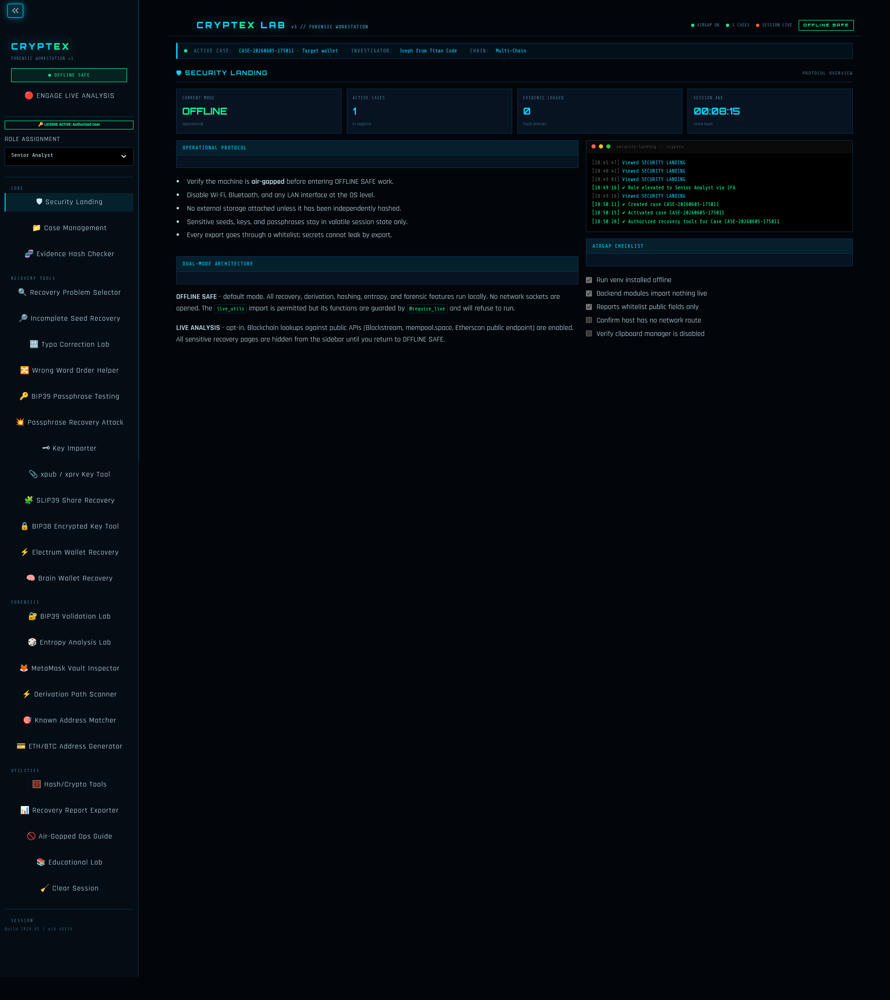

The interface has three zones:

### Sidebar (left panel)

The left sidebar contains:
- **Mode indicator** — shows OFFLINE SAFE (green) or LIVE ANALYSIS (red)
- **Role selector** — your current role (Viewer, Analyst, Senior Analyst, Admin)
- **License status** — shows "LICENSE ACTIVE" when valid
- **Navigation** — all available pages grouped by category (Core, Recovery Tools, Forensics, Utilities)

The navigation only shows pages your current role is allowed to access. If a page is not visible, it means your role does not have permission or no case is active.

### Header bar (top)

The header shows:
- **AIRGAP OK** — confirms no network calls have been made this session
- **N CASES** — number of open cases in the registry
- **SESSION LIVE** — session uptime counter
- **OFFLINE SAFE / LIVE ANALYSIS** button — the current operating mode

### Main content area

The main area shows the currently selected page. Every page has:
- A section title with an icon
- A live **audit terminal** on the right side (small green terminal showing recent actions)
- The tool's inputs and controls

### Audit log strip

The green terminal in the top-right of most pages shows your current session's activity in real time. Every action you take — navigating pages, running recoveries, changing roles — is timestamped and logged permanently to `audit_logs/audit.jsonl`.

---

## 8. Role Assignment and Elevation

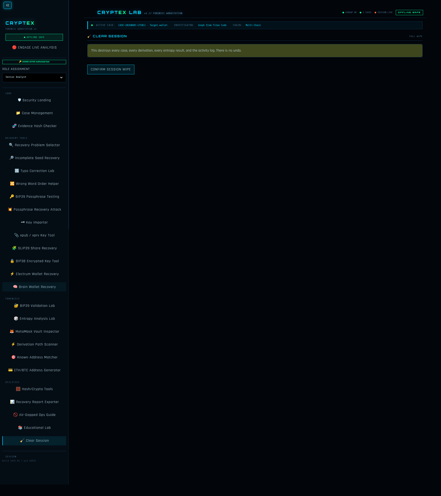

Cryptex Lab uses four roles with increasing access:

| Role | What you can do |
|---|---|
| **Viewer** | Read-only — see security landing, case registry, hashing tools |
| **Analyst** | Basic recovery — typo correction, wrong word order, derivation paths, address matching |
| **Senior Analyst** | Full recovery — incomplete seeds, passphrase attacks, BIP38, SLIP39, xpub, brain wallet, key import |
| **Admin** | Same as Senior Analyst — intended for the lead examiner |

### Switching roles

Use the **ROLE ASSIGNMENT** dropdown in the sidebar. Switching to Analyst requires no code. Switching to Senior Analyst or Admin requires a live TOTP code from your authenticator app.

### Using 2FA to elevate

1. Select the target role from the dropdown
2. A dialog box appears asking for the 6-digit code
3. Open your authenticator app, find the matching entry, and type the current code
4. Click Confirm — you are now elevated until you switch away or the session ends

> Roles do not persist between sessions. Every time you launch the app you start as Analyst and must re-elevate if needed.

---

## 9. Working Offline — The Golden Rule

**Never enter a real seed phrase while in LIVE ANALYSIS mode.**

OFFLINE SAFE mode (the default) is the only state where you should work with real secrets. In this mode:
- No network sockets are opened
- No data leaves the machine
- Blockchain lookups are blocked
- All seed-handling pages are available

LIVE ANALYSIS mode is opt-in and intended only for looking up public blockchain data (address balances, transaction history) after you have closed all sensitive pages. When you switch to Live mode, recovery pages are automatically hidden from the sidebar.

The header bar always shows your current mode prominently. The **OFFLINE SAFE** button glows green. The **LIVE ANALYSIS** button glows red.

---

## 10. Starting a Case

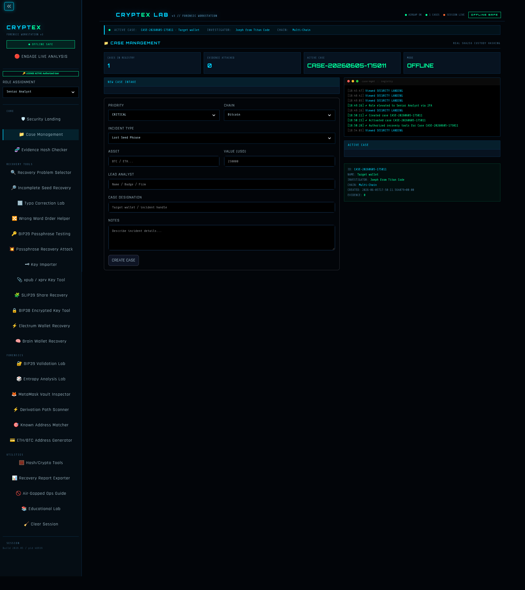

Before using any recovery or forensic tool, you must create and activate a **case**. A case is a record that ties all your work to a specific investigation — it captures the case number, priority, asset type, lead analyst, and case description. Every action you take is logged against the active case.

### Creating a case

1. Navigate to **Case Management** in the sidebar
2. Fill in the form:
   - **Priority** — Critical / High / Medium / Low
   - **Chain** — the blockchain type (Bitcoin, Ethereum, Multi-Chain, etc.)
   - **Incident Type** — what kind of recovery this is (lost seed, forgotten passphrase, etc.)
   - **Asset** — the asset type (BTC, ETH, tokens, etc.)
   - **Value code** — internal reference (optional)
   - **Lead analyst** — the examiner's name
   - **Case description** — notes about the situation
3. Click **CREATE CASE** — a case ID is generated automatically (format: `CASE-YYYYMMDD-HHMMSS`)
4. Click **ACTIVATE** next to the new case to set it as the active case

### What happens when a case is active

The header bar shows the active case ID, investigator name, and chain type in a breadcrumb. All recovery tools are now accessible to roles that have permission. The audit log records every action under this case ID.

### Case states

- **OFFLINE** — case is open but no live blockchain data has been requested
- **LIVE** — case has had at least one live API call (only in Live Analysis mode)

---

## 11. Recovery Tools — Detailed Guide

### Recovery Problem Selector

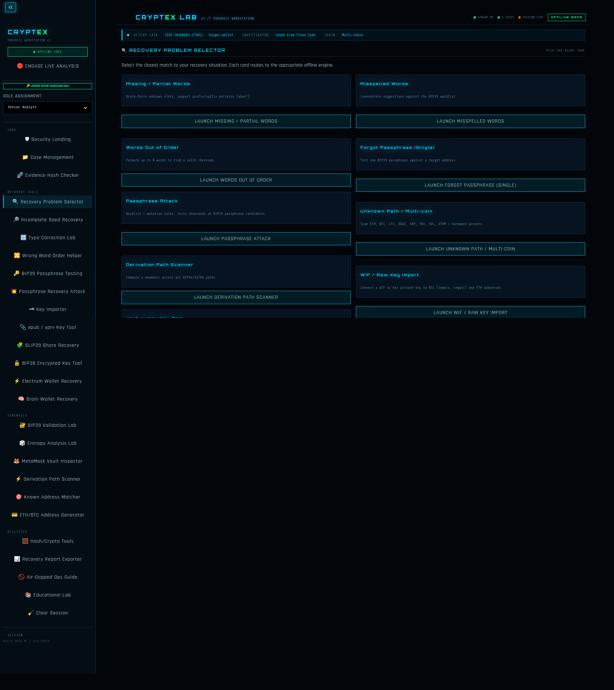

If you are unsure which tool to use, start here. The selector presents eight clearly-labelled scenarios — click the one that best describes your situation and you will be taken directly to the right tool. The options are:

| Tile | When to use it |
|---|---|
| Missing / Partial Words | You have most of the seed but some words are missing or unknown |
| Misspelled Words | You wrote down the words but some are misspelled |
| Words Out of Order | You have all words but are unsure of the sequence |
| Forgot Passphrase (Single) | You remember roughly what the passphrase was |
| Passphrase Attack | You need to test many passphrase candidates automatically |
| Unknown Path / Multi-Coin | You have a valid seed but cannot find your balance |
| WIF / Raw Key Import | You have a raw private key or WIF string, not a seed phrase |

---

### Incomplete Seed Recovery

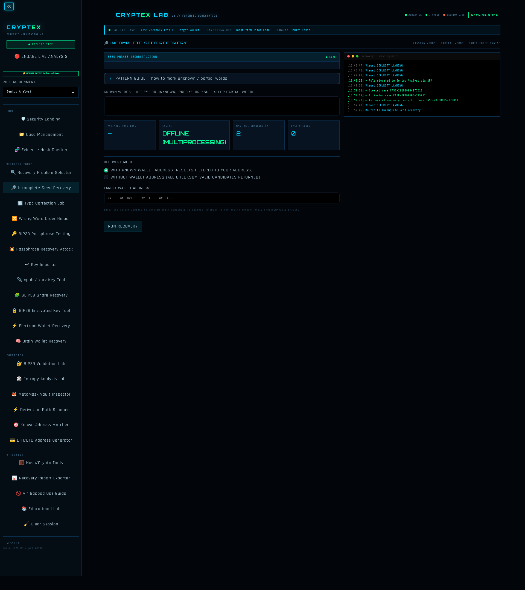

Use this tool when you have a seed phrase with one or two words missing or completely unknown.

#### How it works

The BIP39 standard has a checksum built into the last word. For a 12-word seed, only 1 in 2048 combinations of the final word is mathematically valid. For missing interior words, the tool exhaustively tests all 2048 possible BIP39 words in each unknown position. With a known wallet address to filter against, only mathematically valid combinations that also produce that address are returned.

#### How to use it

1. Navigate to **Incomplete Seed Recovery**
2. Read and accept the authorization acknowledgement
3. In the phrase input, type your seed replacing unknown words with `?`:
   ```
   abandon ? abandon abandon abandon abandon abandon abandon abandon abandon abandon about
   ```
4. If you have two unknown words:
   ```
   abandon ? abandon ? abandon abandon abandon abandon abandon abandon abandon about
   ```
5. **Recovery mode:**
   - **With known wallet address** — the tool filters candidates and only shows matches. Recommended.
   - **Without wallet address** — all mathematically valid candidates are returned. May be thousands.
6. Optionally enter your **Target Wallet Address** (the address you expect to see)
7. Click **RUN RECOVERY**

#### What the results mean

Results appear as a table. Each row is a valid candidate showing the full phrase and (if an address was provided) the matching address. If your address is shown, that row is your correct seed.

> **Tip:** Providing a known wallet address makes recovery much faster and eliminates false positives. Even a single address from your wallet (receiving address from an old transaction) is enough.

---

### Typo Correction Lab

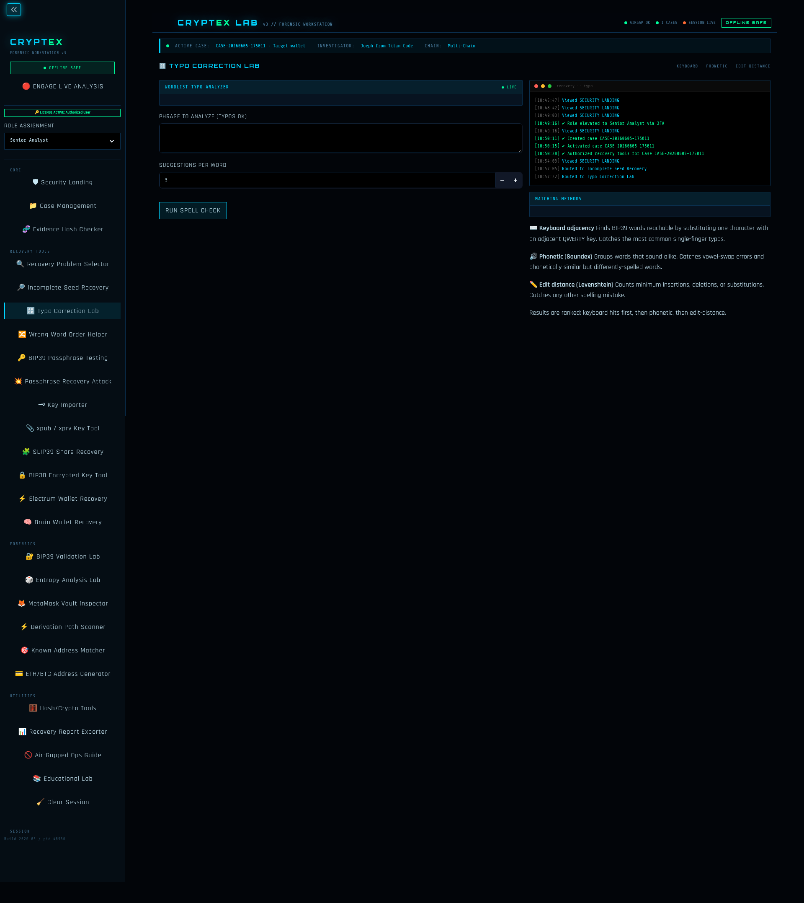

Use this when you have written down seed words but some are misspelled, partially remembered, or phonetically transcribed.

#### How it works

The tool uses three correction methods simultaneously:

- **Keyboard adjacency (⌨️)** — finds BIP39 words reachable by one adjacent-key substitution on a QWERTY keyboard. E.g. `abandob` → `abandon` (n and b are adjacent).
- **Phonetic similarity (🔊)** — uses Soundex phonetic coding to group words that sound alike. E.g. `ABANDONN` → `abandon`.
- **Edit distance (✏️)** — classic Levenshtein distance. Finds words that differ by the fewest character insertions, deletions, or substitutions.

#### How to use it

1. Navigate to **Typo Correction Lab**
2. In the text field, type the full phrase as you wrote it down, including the misspelled words
3. Set "Suggestions per word" (default 5 is usually enough)
4. Click **RUN SPELL CHECK**

Results show each word in your input with suggestions grouped by method. Words already in the BIP39 wordlist are shown in green. Misspelled words show their corrections with the method label (⌨️ keyboard, 🔊 phonetic, ✏️ edit distance).

#### Example

Input: `abandon abanndon absnd abut`

Results:
- `abandon` — valid BIP39 word
- `abanndon` — suggestions: `abandon` (✏️ edit distance 1)
- `absnd` — suggestions: `absent` (✏️), `absurd` (✏️)
- `abut` — suggestions: `about` (✏️ edit distance 1), `adult` (✏️)

---

### Wrong Word Order Helper

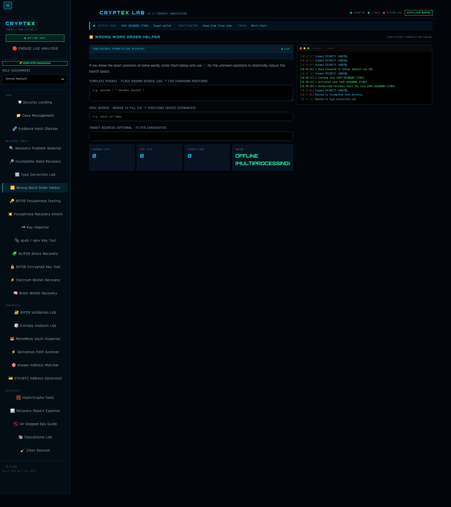

Use this when you have all the correct words but they are in the wrong order, or you are unsure of the order of a few positions.

#### How it works

Rather than testing all possible permutations (12! = 479 million for a 12-word phrase), the tool lets you:
1. Fix the words you are confident about in their correct positions
2. Mark only the uncertain positions with `?`
3. List the pool of words that should fill those positions

The tool then tests all permutations of just the uncertain words, using the BIP39 checksum to eliminate invalid combinations. With an address filter, only matching results are shown.

#### How to use it

1. In the **Complete Phrase** field, enter the phrase with `?` for uncertain positions:
   ```
   abandon ? abandon ? abandon abandon abandon abandon abandon abandon abandon ?
   ```
2. In the **Pool Words** field, list the words that go in those `?` positions (space-separated):
   ```
   about actual adapt
   ```
3. Optionally enter a target address
4. Click **RUN RECOVERY**

---

### BIP39 Passphrase Testing

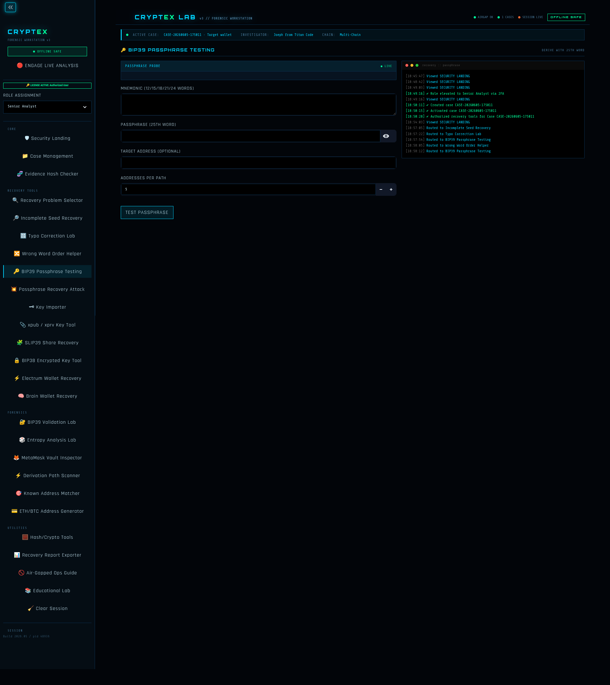

Use this when you have a valid seed phrase and want to test whether a specific passphrase produces your known wallet address. This is the single-candidate version — for testing thousands at once, use Passphrase Recovery Attack.

#### How to use it

1. Navigate to **BIP39 Passphrase Testing**
2. Enter the full seed phrase (12 or 24 words)
3. Enter the passphrase to test (leave blank to test no-passphrase)
4. Optionally enter a target wallet address
5. Set how many addresses per path to check (default: 5)
6. Click **TEST PASSPHRASE**

The results show derived addresses for all standard paths (ETH BIP44, BTC Native SegWit, BTC SegWit, BTC Legacy). If your known address appears, the passphrase is confirmed.

---

### Passphrase Recovery Attack

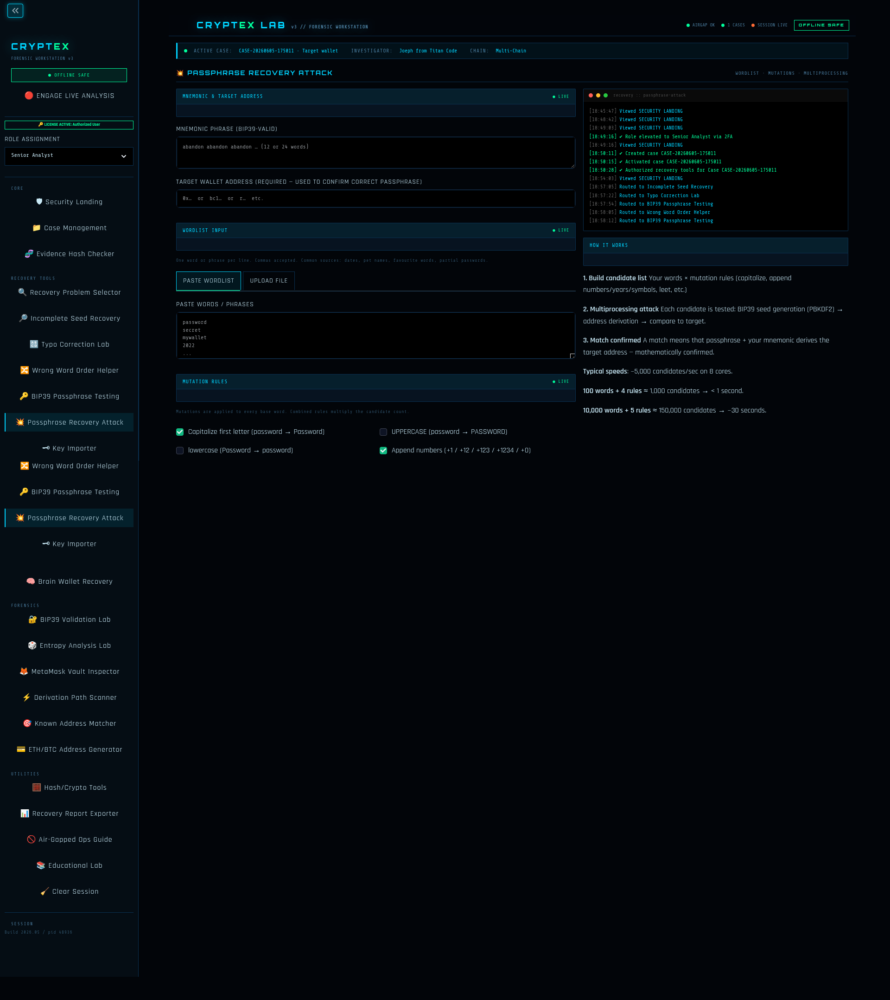

*Requires Senior Analyst role or above.*

Use this when you remember roughly what your passphrase was but cannot recall it exactly. The tool builds a candidate list from a base wordlist and applies mutation rules, then tests each candidate against your seed phrase and a known wallet address.

#### What are mutation rules?

Mutation rules transform each word in your wordlist into many variants:
- **Capitalize first letter** — `password` → `Password`
- **ALL CAPS** — `password` → `PASSWORD`
- **Append numbers (0-9)** — `password` → `password1`, `password2`, ...
- **Swap letters (i→1, e→3, a→4)** — `password` → `p4ssw0rd`
- **Append symbols (!@#)** — `password` → `password!`

You can combine multiple rules to build large candidate lists from a short wordlist.

#### How to use it

1. Navigate to **Passphrase Recovery Attack**
2. Enter the full seed phrase
3. Enter a known target wallet address (required — otherwise there is nothing to match against)
4. Build the candidate list:
   - **Paste wordlist** — type or paste candidate words, one per line (e.g. common names, dates, pet names you might have used)
   - Or **Upload file** — upload a `.txt` file with one candidate per line
5. Select which mutation rules to apply
6. Review the **candidate estimate** — the tool shows how many candidates will be tested and estimated time
7. Click **START ATTACK**

A progress bar shows candidates checked and speed (candidates/second). The tool uses all available CPU cores. If a match is found, it stops immediately and shows the matching passphrase.

> **Speed guide:** BIP39 PBKDF2 is intentionally slow (~2,048 rounds). Expect ~300-2,000 candidates/second depending on your hardware. A list of 100 words with 4 mutation rules = ~4,000 candidates = under 30 seconds.

---

### Key Importer

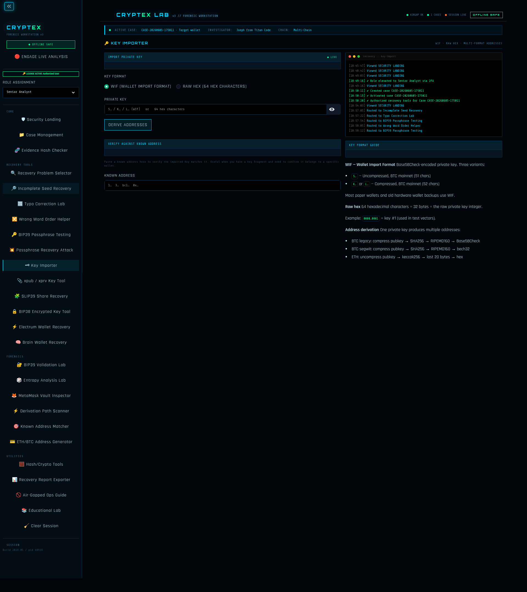

*Requires Senior Analyst role or above.*

Use this when you have a raw private key or WIF-encoded key rather than a seed phrase. This situation occurs with:
- Old Bitcoin Core wallet exports
- Paper wallets from bitaddress.org
- Single-key hardware tokens
- Keys exported from exchange accounts (rare)

#### Key formats supported

| Format | Description | Example |
|---|---|---|
| **WIF** | Wallet Import Format — Base58-encoded private key | `KwDiBf89QgGb...` (compressed) or `5Hu...` (uncompressed) |
| **Raw hex** | 64 hex characters | `0a1b2c3d...` (32 bytes) |

#### How to use it

1. Select the key format (WIF or Raw Hex)
2. Paste the private key
3. Click **DERIVE ADDRESSES**

The tool derives all standard address formats:
- **BTC Legacy (P2PKH)** — starts with `1`
- **BTC SegWit (P2SH-P2WPKH)** — starts with `3`
- **BTC Native SegWit (P2WPKH)** — starts with `bc1`
- **ETH / EVM** — starts with `0x`

If you provide a **known address**, it highlights which derived address matches, confirming the key is correct.

> **Security note:** The WIF key is never written to disk or included in any export. It exists only in memory for the duration of this page view.

---

### xpub / xprv Key Tool

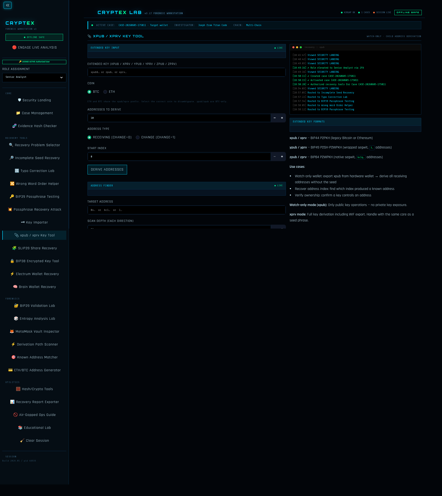

*Requires Senior Analyst role or above.*

Use this when you have an extended key exported from a hardware wallet or watch-only wallet app (Electrum, Sparrow, BlueWallet, Ledger Live) but not the original seed phrase.

#### Extended key formats

| Prefix | Standard | Address type | Has private key? |
|---|---|---|---|
| `xpub` / `xprv` | BIP44 | Legacy P2PKH (1...) | xprv only |
| `ypub` / `yprv` | BIP49 | SegWit P2SH (3...) | yprv only |
| `zpub` / `zprv` | BIP84 | Native SegWit (bc1...) | zprv only |
| `xpub` / `xprv` | BIP44 | Ethereum (0x...) | xprv only |

Note: Ethereum uses the same `xpub`/`xprv` prefix as Bitcoin BIP44. Select the correct **coin** (BTC or ETH) to disambiguate.

#### How to use it

1. Paste the extended key into the input field
2. Select **BTC** or **ETH**
3. Choose **Receiving (change=0)** or **Change (change=1)** chain
4. Set a **start index** (default 0) and **count** (default 10)
5. Click **DERIVE ADDRESSES**

The table shows address index, full address, and derivation description. If you have a known address, paste it in the **Target Address** field and click **SCAN DEEP SEARCH** — the tool scans both receiving and change chains up to 50 addresses looking for a match.

> **Watch-only mode:** If you paste an `xpub` (public key only), addresses are derived but no private keys are shown — safe for balance verification. Paste an `xprv` (private key) to also derive WIF keys for each address (optional toggle, off by default).

---

### SLIP39 Share Recovery

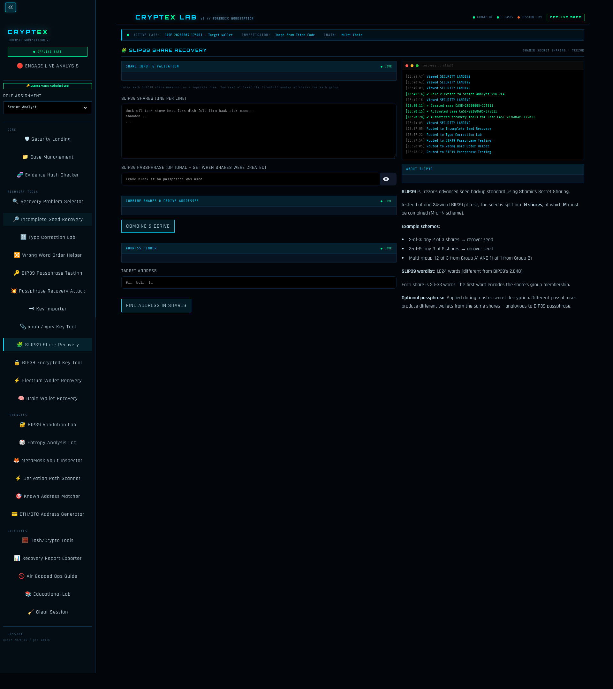

*Requires Senior Analyst role or above.*

Use this when the original wallet was backed up using SLIP39 (Shamir's Secret Sharing) rather than a standard BIP39 mnemonic. Trezor Model T supports SLIP39. Each share is a 20-33 word mnemonic from SLIP39's own 1024-word wordlist (different from BIP39).

#### Understanding SLIP39

SLIP39 splits your master secret into **N shares** across one or more groups. You need at least **threshold** shares to recover — possessing fewer than the threshold reveals nothing about the secret. Common configurations:
- 2-of-3: any 2 of 3 shares recover the wallet
- 3-of-5: any 3 of 5 shares recover the wallet
- Multi-group: e.g. 2-of-3 groups, each with their own threshold

#### How to use it

1. Navigate to **SLIP39 Share Recovery**
2. Paste your shares — one per line in the input box. Each share is a 20-33 word phrase:
   ```
   academic acid academic acne academic academic academic academic academic academic academic academic academic academic academic academic academic academic academic academic
   ```
3. If a **passphrase** was set when the shares were created, enter it (most users have none)
4. Click **COMBINE & DERIVE**

The tool validates each share and shows whether you have enough to meet the threshold. On success, it derives:
- ETH/EVM addresses (5 indices)
- BTC Native SegWit bc1... (5 indices)
- BTC SegWit 3... (5 indices)
- BTC Legacy 1... (5 indices)

If you have a known target address, paste it in the **Target Address** field before combining and click **FIND ADDRESS IN SHARES** — the tool will confirm which address and index matched.

---

### BIP38 Encrypted Key Tool

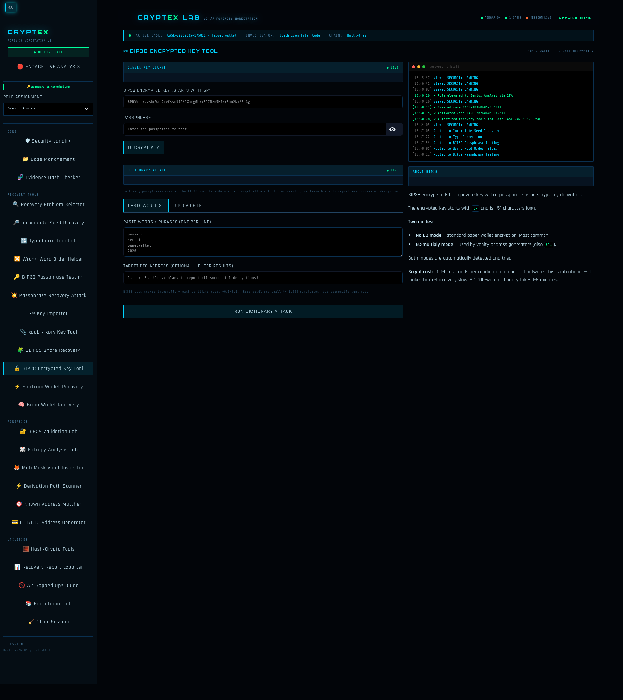

*Requires Senior Analyst role or above.*

Use this when you have a BIP38-encrypted Bitcoin private key (typically from a paper wallet printed at bitaddress.org). BIP38 keys start with `6P`.

#### The two decryption modes

**Single decrypt** — you know the passphrase:
1. Paste the `6P...` key
2. Enter the passphrase
3. Click **DECRYPT KEY**
Result: the raw WIF private key and all derived Bitcoin addresses.

**Dictionary attack** — you forgot the passphrase:
1. Paste the `6P...` key
2. Build a candidate wordlist (paste or upload file)
3. Optionally provide a known BTC address to filter results
4. Click **RUN DICTIONARY ATTACK**

> **Speed note:** BIP38 uses scrypt for key stretching — deliberately slow at ~0.1-0.5 seconds per candidate. A 1,000-word dictionary takes ~2-8 minutes. Plan accordingly.

---

### Electrum Wallet Recovery

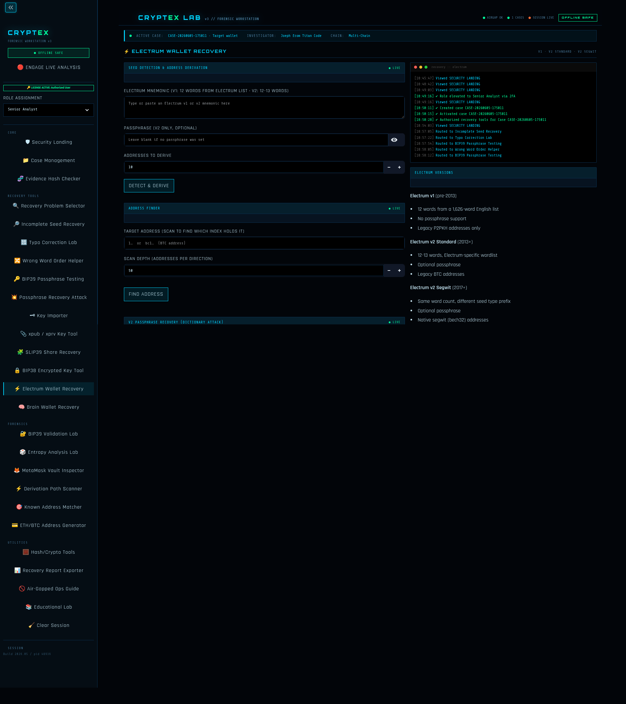

*Requires Senior Analyst role or above.*

Use this when the wallet was created with the Electrum Bitcoin client, which uses its own seed format — different from BIP39. Electrum seeds are 12-13 word phrases from Electrum's own wordlist.

#### Electrum versions

| Version | Word count | Wordlist | Passphrase? |
|---|---|---|---|
| v1 (old) | 12 | 1,626 English words | No |
| v2 Standard | 12 | Same as BIP39 | Optional |
| v2 Segwit | 12 | Same as BIP39 | Optional |

The tool auto-detects which version your seed belongs to.

#### How to use it

1. Paste the Electrum seed phrase (12 words)
2. If v2, enter the passphrase if one was used (leave blank if none)
3. Set how many addresses to derive (default: 5)
4. Click **DETECT & DERIVE**

The tool shows derived Legacy P2PKH addresses for the external (receiving) chain. If you have a known address, paste it in the **Target Address** field and click **FIND ADDRESS** to scan up to the set depth across both external and internal (change) chains.

#### Passphrase recovery

If you know the Electrum seed but forgot the passphrase, use the **Electrum Passphrase Attack** section:
1. Paste the seed
2. Build a candidate wordlist
3. Paste a known address
4. Click **RUN ATTACK**

---

### Brain Wallet Recovery

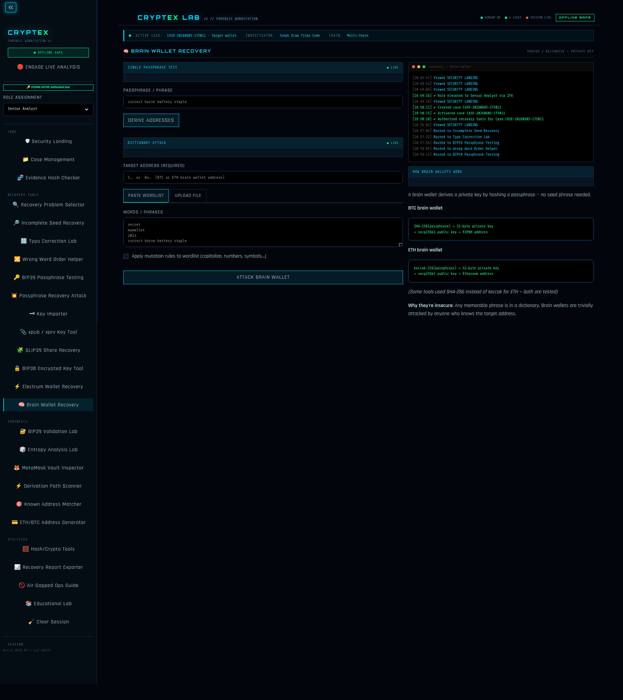

*Requires Senior Analyst role or above.*

Use this when the wallet was created from a memorable passphrase hashed directly into a private key — no seed phrase, no hardware wallet, just a phrase someone memorized.

#### How brain wallets work

- **Bitcoin brain wallet:** SHA256(passphrase) → private key → P2PKH address
- **Ethereum brain wallet:** keccak256(passphrase) → private key → address  
  (also tests SHA256 → ETH as some older tools used this)

#### Single derive

1. Enter the passphrase/phrase
2. Click **DERIVE ADDRESSES**

Instantly shows the BTC and ETH addresses that phrase produces. If those addresses match your wallet, you have confirmed the brain wallet.

#### Dictionary attack

If you remember roughly what phrase was used:
1. Build a candidate list
2. Enter the known wallet address as the target
3. Optionally apply mutation rules (capitalize, append numbers, etc.)
4. Click **ATTACK BRAIN WALLET**

Brain wallets are extremely fast to test (~100,000+ candidates/second via multiprocessing) because no PBKDF2 is involved.

---

## 12. Forensics Tools — Detailed Guide

### BIP39 Validation Lab

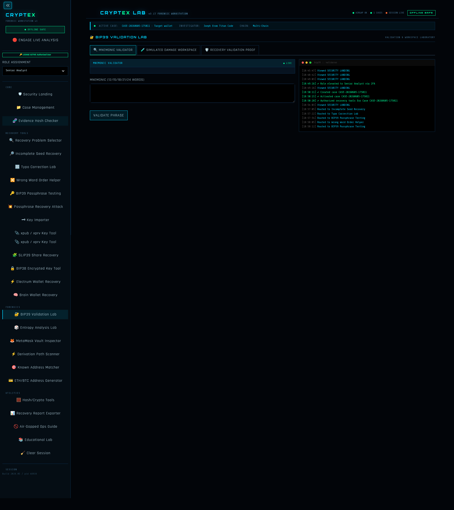

Use this before attempting any recovery to confirm whether your seed phrase is structurally valid. This does not require a case to be active.

The tool checks:
- **Word count** — must be 12, 15, 18, 21, or 24
- **Wordlist membership** — every word must be in the official BIP39 English wordlist
- **Checksum** — the last word encodes a checksum; an invalid checksum means at least one word is wrong

Three modes are available:
- **Mnemonic validator** — basic structural check
- **Simulate device mnemonic** — tests whether a hardware wallet would accept this phrase
- **Recovery validation proof** — generates a forensic proof suitable for case documentation

#### How to use it

1. Navigate to **BIP39 Validation Lab**
2. Paste the seed phrase
3. Click **VALIDATE PHRASE**

A green result means the phrase is structurally valid. A red result shows which check failed.

---

### Entropy Analysis Lab

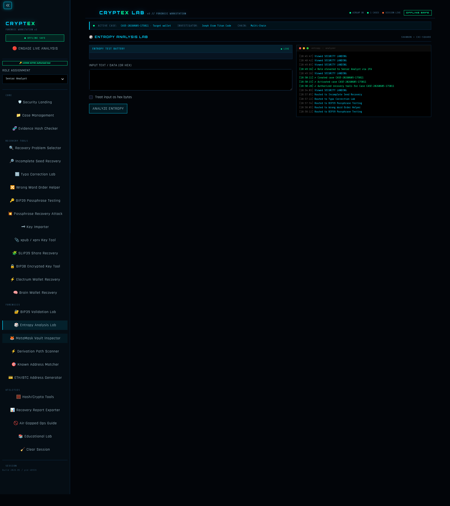

Use this to determine whether a byte sequence could plausibly be wallet-related material (high entropy) or is clearly not random (low entropy, such as text or structured data).

Entropy is measured in bits per byte. True random data scores close to 8.0 bits/byte. Text typically scores 4-5. Wallet seeds, private keys, and encrypted data score 7.5-8.0.

#### How to use it

1. Paste hex-encoded bytes or a base64 string in the input field
2. Click **ANALYSE ENTROPY**

Results show the Shannon entropy score and an interpretation (e.g. "Consistent with encrypted or random data — possible wallet material").

---

### MetaMask Vault Inspector

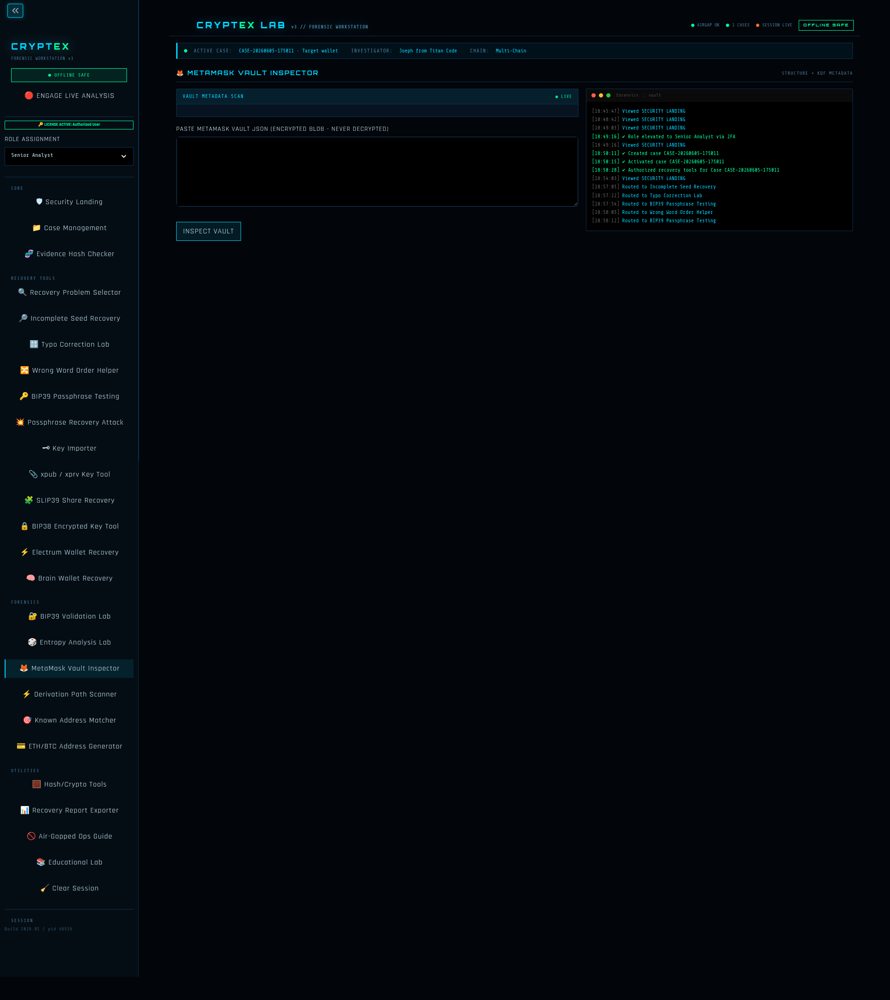

Use this to inspect the structure of a MetaMask vault JSON string without attempting decryption. MetaMask stores an encrypted vault in the browser's local storage when you use a browser extension wallet.

The tool shows:
- Vault format version
- Encryption algorithm used
- Salt and IV values (metadata only — no decryption)
- Whether the format is compatible with known recovery tools

This is useful for forensic documentation — confirming a vault is genuine MetaMask format before attempting other recovery methods.

---

### Derivation Path Scanner

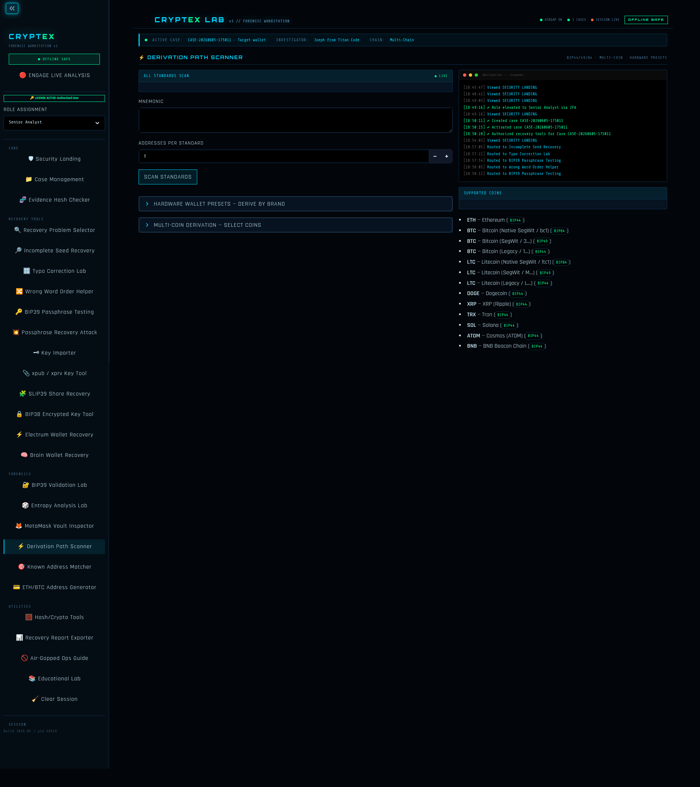

Use this when you have a valid seed but cannot find your balance. The scanner derives addresses for every standard path across 13 coins simultaneously and lets you cross-reference against a known address.

#### Supported coins

ETH, BTC (Native SegWit / SegWit / Legacy), LTC (Native SegWit / SegWit / Legacy), DOGE, XRP, TRX, SOL, ATOM, BNB Smart Chain

#### Hardware wallet presets

Instead of manually selecting coins, use a preset matched to your hardware wallet brand:

| Preset | Covers |
|---|---|
| Ledger Live | ETH BIP44, BTC Native SegWit, BTC Legacy |
| Trezor Suite | ETH BIP44, BTC Native SegWit, BTC SegWit, BTC Legacy |
| MetaMask | ETH BIP44 only |
| Exodus | ETH, BTC Native SegWit, LTC, DOGE |
| Trust Wallet | ETH, BTC Native SegWit, BNB, TRX |
| Coinbase Wallet | ETH, BTC Native SegWit |

#### How to use it

1. Navigate to **Derivation Path Scanner**
2. Enter the seed phrase
3. Choose a preset OR manually select coins to scan
4. Click **SCAN STANDARD** to scan the first 5 addresses per path

For a deep scan with a known address:
1. Enter the known address in **Target Address**
2. Click **FIND ADDRESS** — the tool scans up to 20 indices per path and flags any match

---

### Known Address Matcher

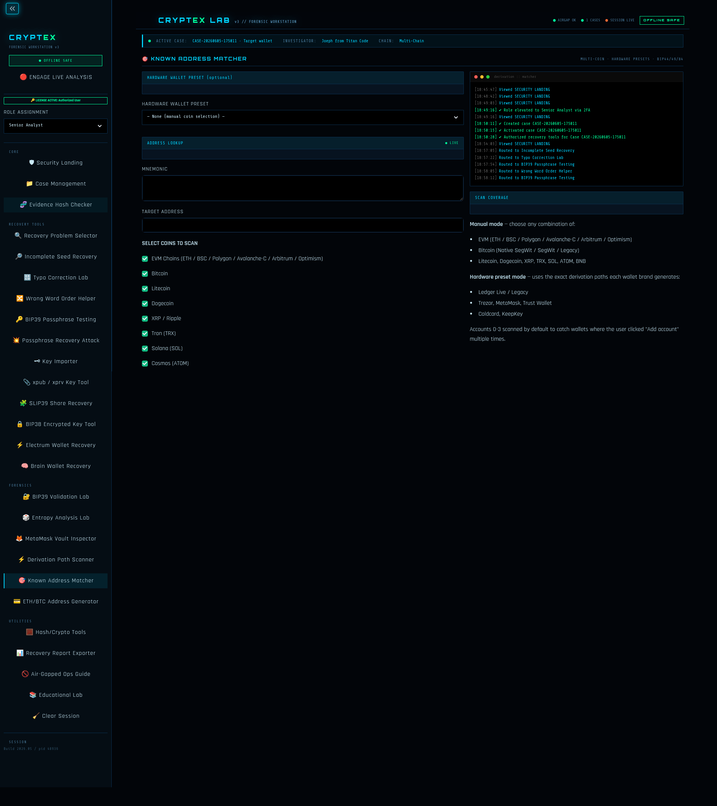

Use this when you know a wallet address and have the seed phrase, but do not know which derivation path was used. This is common when migrating from one wallet app to another.

#### How to use it

1. Enter the seed phrase
2. Enter the known wallet address
3. (Optional) Select a hardware preset to narrow the search
4. Click **FIND MATCH**

The tool scans all standard paths for all supported coins and highlights the exact path that produces your address. Result includes: coin, path, address type, index.

---

### ETH/BTC Address Generator

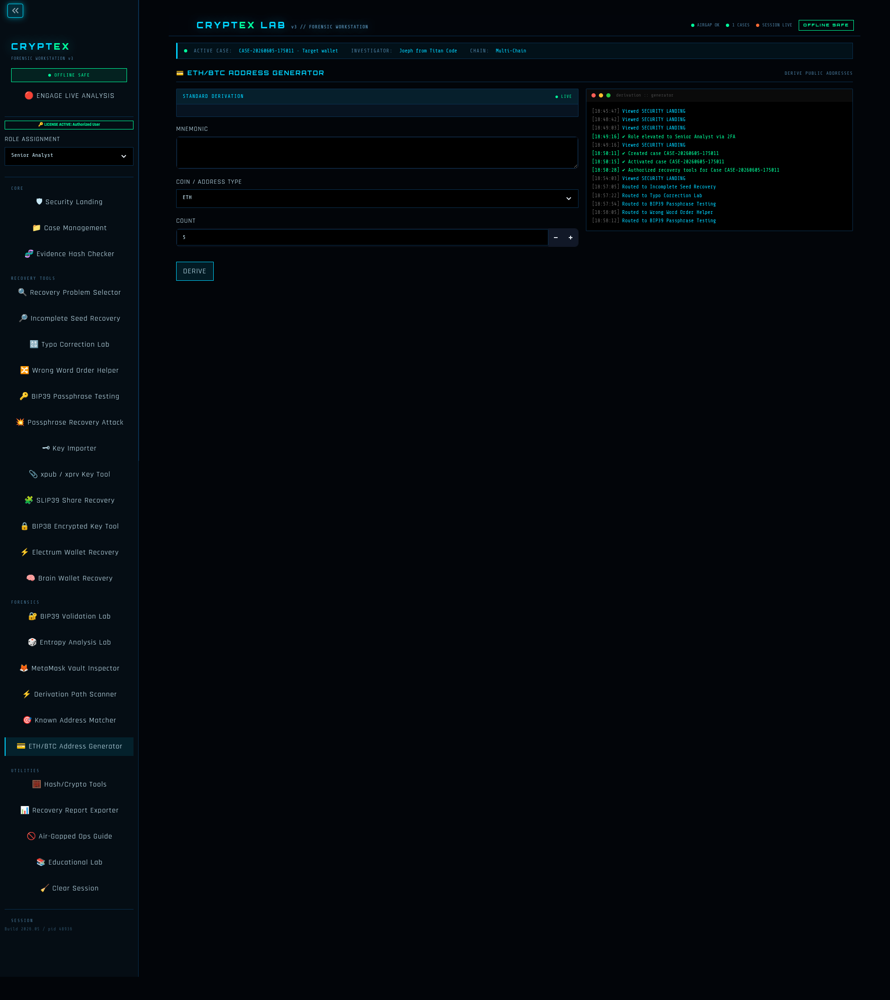

Use this to generate a batch of public wallet addresses from a seed phrase without needing to know the specific derivation path. Useful for creating a list of expected addresses for reconciliation against blockchain records.

Select the coin/address type, set the count, and click **DERIVE**. Only public addresses are shown — no private keys. Safe to use for documentation and evidence.

---

## 13. Utilities

### Hash / Crypto Tools

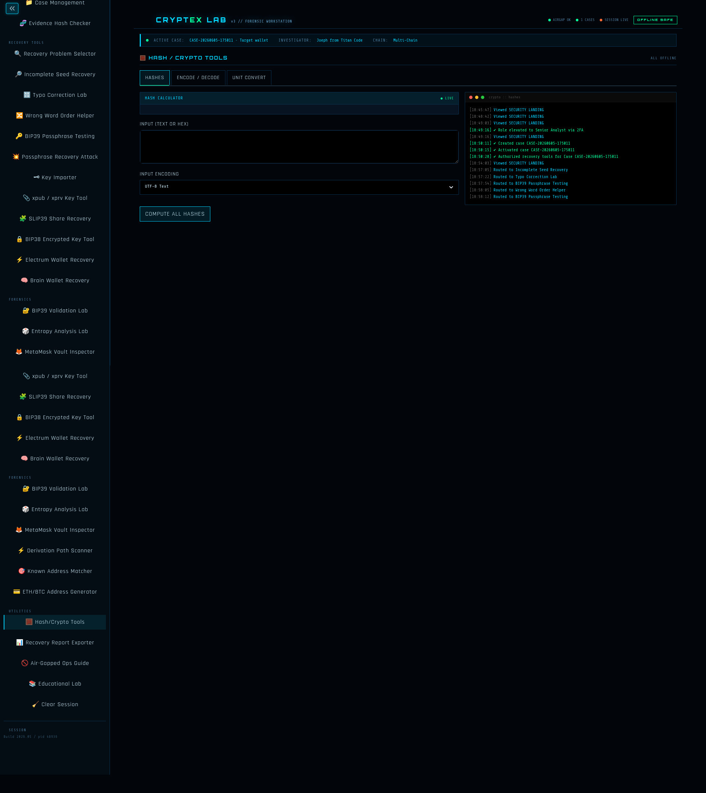

A general-purpose tool for:
- **Hashing** — SHA-256, SHA-512, SHA-3, MD5, RIPEMD-160, BLAKE2
- **Encoding / decoding** — Base58, Base64, hex
- **Conversions** — bytes to hex, hex to bytes

All operations run locally. No data is sent anywhere. Useful for verifying checksums, computing address hashes for documentation, or cross-checking tool outputs.

---

### Recovery Report Exporter

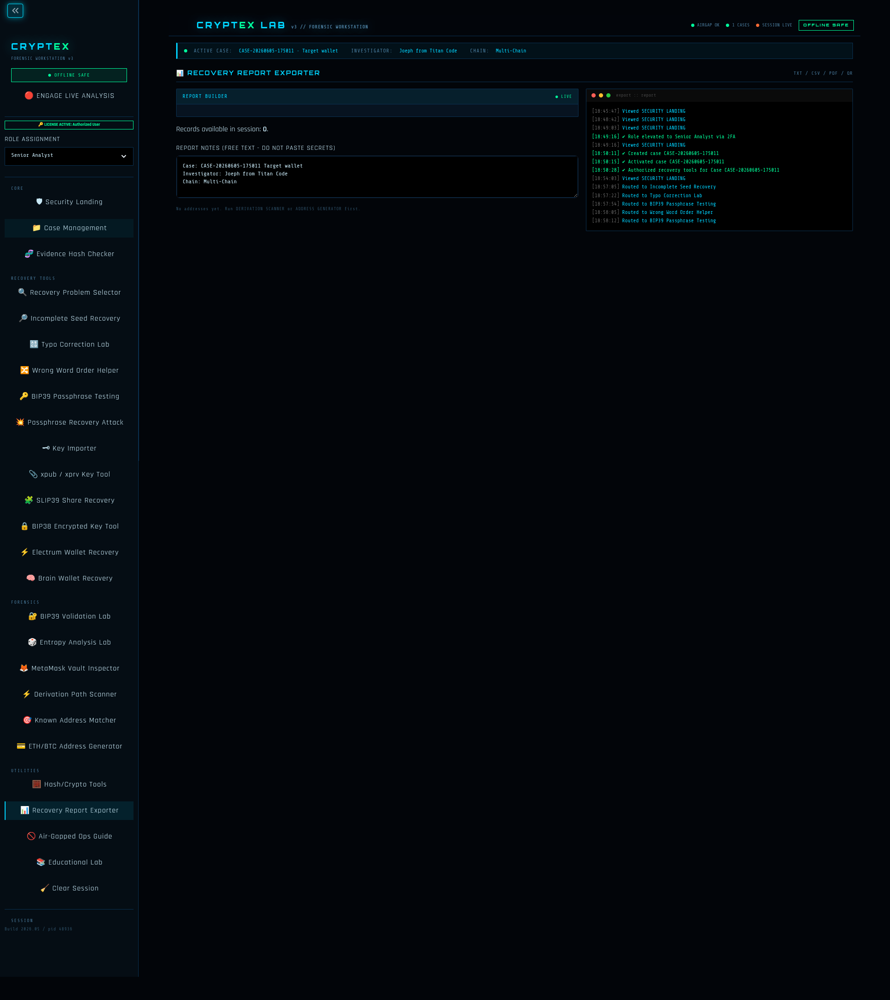

Use this to produce a formal forensic report of your recovery session. The exporter produces a signed, tamper-evident PDF containing:
- Case information (case ID, investigator, date, chain)
- Examiner notes
- Recovery findings (addresses and derivation paths found)
- Evidence integrity SHA-256 hash of the document itself

#### Important: What the exporter will NOT include

The exporter applies a strict whitelist. The following are automatically blocked from appearing in any export:
- Seed phrases / mnemonics
- Private keys
- WIF keys
- Passphrases
- Extended private keys (xprv)
- Master secrets

Only public data — wallet addresses and derivation paths — can appear in an exported report. This is enforced at the code level and cannot be bypassed from the UI.

#### How to use it

1. After completing your recovery work, navigate to **Recovery Report Exporter**
2. Enter your examiner notes in the notes field
3. Click **GENERATE PDF**
4. Download the PDF

The report is timestamped in UTC and includes a SHA-256 hash of its own content for integrity verification.

---

### Air-Gapped Ops Guide

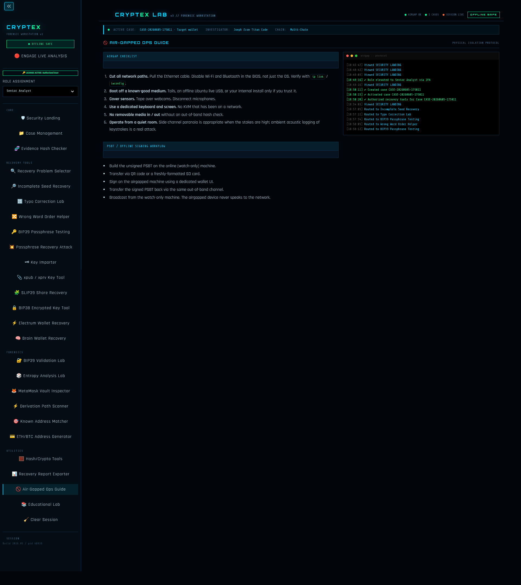

A quick-reference security checklist for setting up and verifying an air-gapped workstation. Covers:
- Network isolation steps (disable Wi-Fi, Bluetooth, LAN)
- Physical media controls
- Screen privacy
- Transfer protocols for getting the app onto an offline machine

This page does not require a case to be active.

---

### Educational Lab

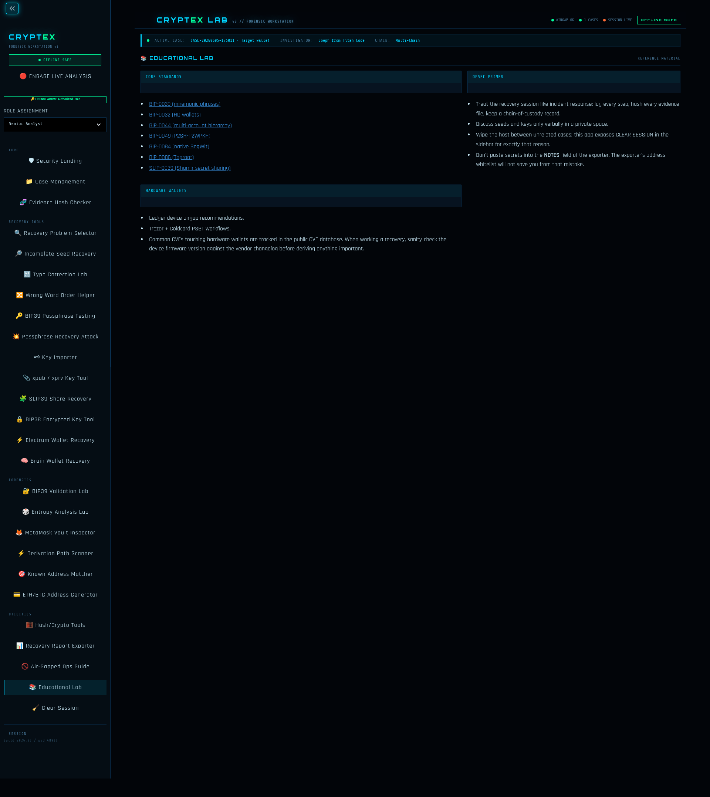

A reference library with educational content covering:
- BIP standards (BIP32, BIP39, BIP44, BIP49, BIP84)
- BIP38 paper wallet protocol
- SLIP39 Shamir sharing scheme
- Common recovery scenarios and best practices
- Ledger / Trezor / MetaMask wallet internals

No input is required — this is read-only reference material.

---

## 14. Live Analysis Mode

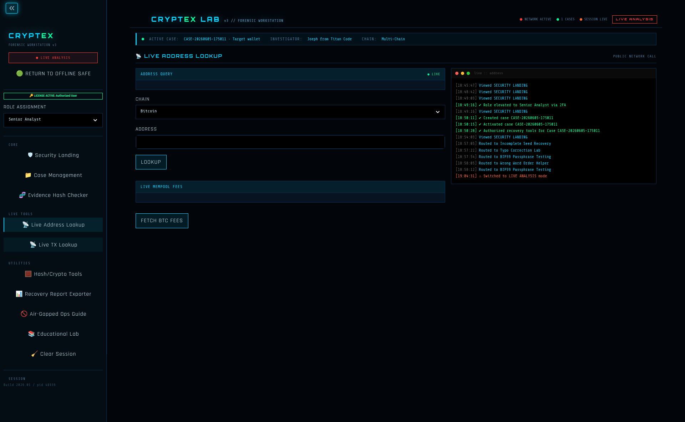

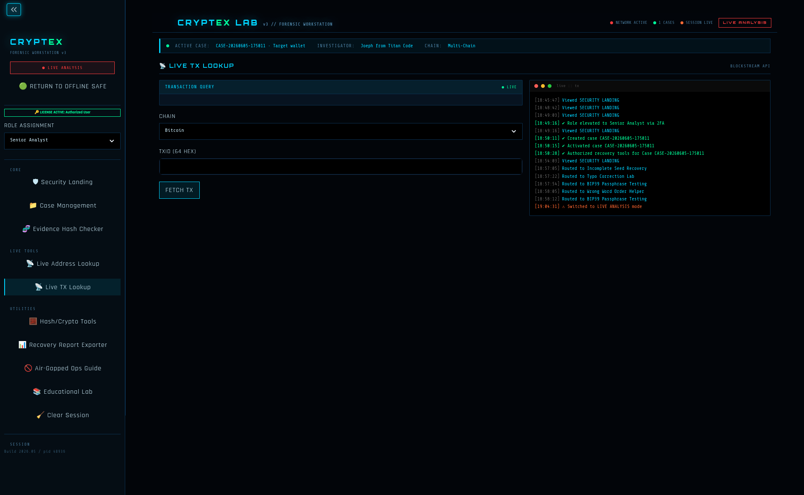

Live Analysis mode enables network calls to public blockchain APIs. It is strictly opt-in — you must click **ENGAGE LIVE ANALYSIS** in the sidebar.

**When you switch to Live mode:**
- The header turns red and shows **LIVE ANALYSIS**
- Recovery tools (all seed-handling pages) disappear from the sidebar
- Only Live Tools, Utilities, and Core pages remain visible
- The airgap status changes to **NETWORK ACTIVE**

### Live Address Lookup

Query an address balance and transaction history on Bitcoin, Ethereum, or supported EVM chains. Enter the address, select the chain, and click **LOOKUP**.

### Live TX Lookup

Look up a transaction by its 64-character hex transaction ID. Select the chain and click **FETCH TX**.

### Returning to offline mode

Click **RETURN TO OFFLINE SAFE** in the sidebar. Recovery tools reappear immediately. 

> **Best practice:** Only enter Live mode after closing all seed-phrase sessions and clearing sensitive fields. Never paste a seed phrase into any field while in Live mode.

---

### Clear Session


The **Clear Session** button (bottom of sidebar) destroys all session state — every case, every derivation result, every entropy result, and the activity log. **There is no undo.**

Use this at the end of every session or before handing the workstation to another operator. It does not delete audit logs — those are permanent.

---

## 15. Common Workflows — Step by Step

### Workflow A: Recover a seed with one missing word

**Situation:** You have 11 of 12 words and know one address from the wallet.

1. Confirm **OFFLINE SAFE** mode is active (green header)
2. Open **Case Management** → create and activate a case
3. Navigate to **Recovery Problem Selector** → click **Missing / Partial Words**
4. Accept the authorization form
5. Enter your phrase with `?` for the missing word:
   ```
   word1 word2 ? word4 word5 word6 word7 word8 word9 word10 word11 word12
   ```
6. Select **With known wallet address** mode
7. Enter a wallet address you know belongs to this seed
8. Click **RUN RECOVERY**
9. Within seconds, one candidate appears with the correct word filled in
10. Navigate to **Recovery Report Exporter** to generate a PDF record

---

### Workflow B: Fix a misspelled word

**Situation:** One word in a 12-word seed looks like a typo — `abanddon` instead of `abandon`.

1. Open **Case Management** → activate a case
2. Navigate to **Typo Correction Lab**
3. Paste the full phrase including the misspelled word
4. Click **RUN SPELL CHECK**
5. Review suggestions for `abanddon` — `abandon` should appear with edit distance 1 (✏️)
6. Correct the phrase, then validate it in **BIP39 Validation Lab**
7. Confirm the corrected phrase produces your known address using **Derivation Path Scanner**

---

### Workflow C: Find a balance on a different path

**Situation:** You have a valid seed, the balance shows $0 in your wallet app, but you know coins exist.

1. Navigate to **Derivation Path Scanner**
2. Enter the seed
3. Select the hardware preset for your wallet brand (e.g. Ledger Live, Trezor Suite)
4. Enter a known wallet address in **Target Address**
5. Click **FIND ADDRESS**
6. The tool shows which coin and path (e.g. BTC_NATIVE, index 3) matches your address
7. Use this path information to configure your wallet app correctly

---

### Workflow D: Recover a forgotten BIP39 passphrase

**Situation:** You have the seed phrase but added a passphrase and cannot remember it. You know the wallet address.

*Requires Senior Analyst role.*

1. Elevate to **Senior Analyst** via the role dropdown (enter your 2FA code)
2. Navigate to **Passphrase Recovery Attack**
3. Enter the seed phrase
4. Enter the known wallet address as target
5. Prepare your candidate list — write down every word, date, name, or phrase you might have used, one per line
6. Select mutation rules (Capitalize, Append numbers, Swap letters are common choices)
7. Review the candidate count estimate
8. Click **START ATTACK**
9. If found, the matching passphrase is highlighted

---

### Workflow E: Recover from a paper BIP38 key

**Situation:** You have a printed paper wallet with a `6P...` key and cannot recall the passphrase.

*Requires Senior Analyst role.*

1. Elevate to **Senior Analyst**
2. Navigate to **BIP38 Encrypted Key Tool**
3. Paste the `6P...` key
4. Try **Single Decrypt** first if you have a guess for the passphrase
5. If that fails, build a candidate wordlist and click **RUN DICTIONARY ATTACK**
6. On success, the decrypted WIF key and Bitcoin addresses are shown

---

### Workflow F: Combine SLIP39 shares

**Situation:** A Trezor wallet was backed up with 3-of-5 SLIP39 shares. You have 3 shares.

*Requires Senior Analyst role.*

1. Elevate to **Senior Analyst**
2. Navigate to **SLIP39 Share Recovery**
3. Paste your three shares, one per line
4. Enter the passphrase if one was used during share creation (usually none)
5. Click **COMBINE & DERIVE**
6. Derived addresses appear for ETH, BTC (all types)
7. Confirm against your known address

---

## 16. Security Best Practices

- **Air-gap the workstation.** Disable Wi-Fi, Bluetooth, and all network interfaces at the OS level before entering any seed phrase. The software enforces this procedurally but physical network isolation is your first line of defence.

- **Never paste seeds in Live mode.** The mode switch hides recovery pages, but as physical discipline: close all sensitive browser tabs before switching.

- **Do not take photos of the screen.** Camera sensors can be recovered from deleted images. Use the built-in PDF exporter for all documentation.

- **Lock the screen when stepping away.** Sessions remain active in the browser tab. Anyone who sits at your keyboard can continue your session.

- **Keep your authenticator app entries backed up.** Export or write down the TOTP seed from your authenticator app when setting up. Store it separately from the workstation. If your phone is lost you will need to re-do 2FA setup.

- **The audit log is permanent and non-editable.** Every role change, page visit, recovery run, and authorization is timestamped in `audit_logs/audit.jsonl`. This is by design for chain-of-custody integrity.

- **Do not commit `license.json` or `totp_secrets.json` to version control.** These files are generated locally and contain secrets specific to this machine. They are listed in `.gitignore`.

- **Report anomalies.** If you see "CRITICAL: Build Integrity Check Failed" on launch, stop and contact your administrator. Do not attempt to bypass or override this check — it means a file in the application has been modified since it was shipped.

---

## 17. Troubleshooting

### "MACHINE AUTHORIZATION FAILURE"

Your license is locked to a different machine's fingerprint. Contact your administrator with your Machine ID (shown on the activation screen). They will generate a new license key for your hardware.

### "LICENSE INACTIVE" or activation screen on every launch

The `license.json` file is missing or corrupted. Check that it exists in the application directory. If not, contact your administrator for a new `CXLAB-...` activation key.

### "CRITICAL: Build Integrity Check Failed"

One of the application files has been modified since it was built and signed. If you did not intentionally modify any files:
- Check whether antivirus software altered a file
- Re-extract the original ZIP and reinstall

If you are the developer and made legitimate code changes, re-run `python generate_keys.py` to regenerate the signed manifest.

### TOTP code is not accepted

- Make sure your phone's clock is accurate (TOTP is time-based, ±30 seconds)
- Try the next code (wait up to 30 seconds for the authenticator to refresh)
- If the code is consistently wrong, the secrets file may be corrupt — delete `totp_secrets.json` and redo 2FA setup

### The app does not open in the browser

- Navigate manually to `http://localhost:8501`
- Check the terminal where you ran `python launcher.py` for error messages
- Make sure port 8501 is not in use by another application

### The app shows a blank white page

The Streamlit frontend is still loading. Wait 3-5 seconds and refresh the browser.

### "Non-variable tokens contain words not in the BIP39 English wordlist"

In Incomplete Seed Recovery, this error means some of your fixed (non-`?`) words are not valid BIP39 words. Run the phrase through **Typo Correction Lab** first to fix any misspellings, then retry.

### Dependency installation fails on an air-gapped machine

See [Section 4 — Air-gapped installation](#air-gapped-installation-no-internet-on-the-workstation).

### I reinstalled the operating system — will my license still work?

The license is tied to hardware fingerprint components (CPU, motherboard). A clean OS reinstall on the same hardware should produce the same fingerprint. However, if hardware was replaced or significant changes were made, contact your administrator for a new license.

---

*CRYPTEX LAB v3 — Forensic Workstation | Titan Code | All rights reserved*  
*This document is confidential. Do not distribute outside of authorized personnel.*
